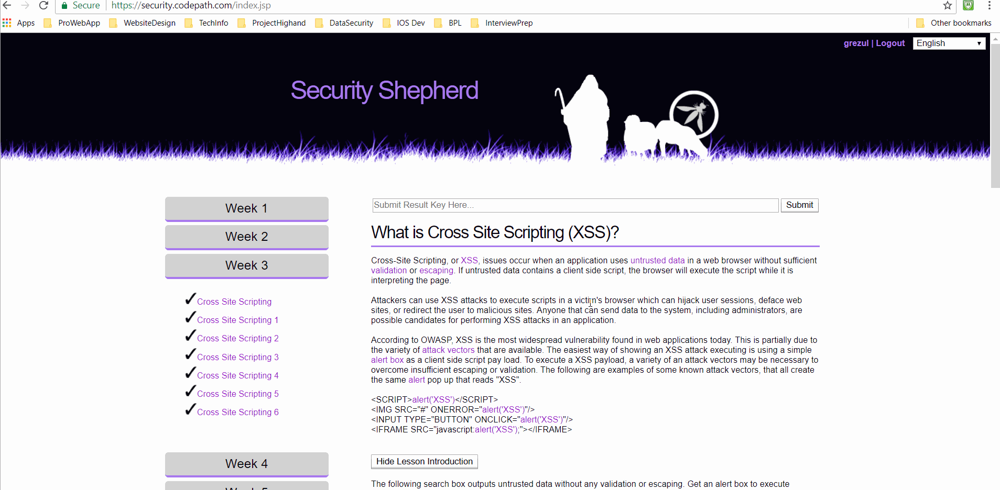

# # Cybersecurity Lab Week 3 - Cross-site scripting - *grezul* 

Time spent: **3** hours spent in total 

## User Stories

The following **required** functionality is completed:

1. [x]  Required: Challenge 1 - Cross-site scripting 1
2. [x]  Required: Challenge 2 - Cross-site scripting 2
3. [x]  Required: Challenge 3 - Cross-site scripting 3 
4. [x]  Required: Challenge 4 - Cross-site scripting 4

The following advanced user stories are optional:

* [x]  Bonus 1: Cross-site scripting 5
* [x]  Bonus 2: Cross-site scripting 6

## Video Walkthrough

Here's a walkthrough of implemented user stories:

GIF created with [LiceCap](http://www.cockos.com/licecap/).

## Notes

Since I already worked with Burp this wasn't a very difficult assignment. I am still working on the last bonus assignment. Hopefully I will remind myself how to complete it. 

## License

    Copyright [2017] [Gregory Szymanski]

    Licensed under the Apache License, Version 2.0 (the "License");
    you may not use this file except in compliance with the License.
    You may obtain a copy of the License at

        http://www.apache.org/licenses/LICENSE-2.0

    Unless required by applicable law or agreed to in writing, software
    distributed under the License is distributed on an "AS IS" BASIS,
    WITHOUT WARRANTIES OR CONDITIONS OF ANY KIND, either express or implied.
    See the License for the specific language governing permissions and
    limitations under the License.
